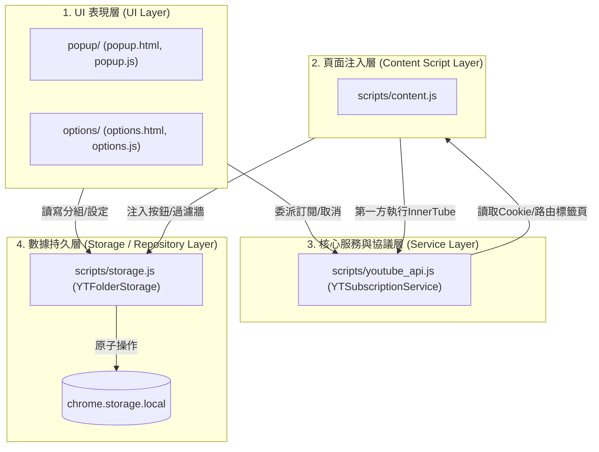
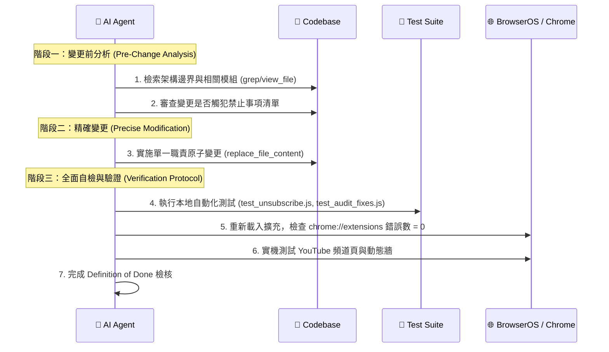

---
project:
  name: "youtube-subscription-folders"
  type: "browser-extension"
  target_platform: "Chrome / Chromium Manifest V3"
  architecture_pattern: "Layered Modular (Zero-Dependency Vanilla JS)"
  primary_language: "JavaScript (ES2022+)"
  runtime_environment: "Chrome Extension MV3 (Service Worker + Content Scripts + Extension Pages)"
agent_rules_version: "1.0.0"
last_updated: "2026-09-22"
criticality_level: "HIGH"
---

# 🤖 AGENT_CONTEXT.md - AI Agent 專用核心專案規範文檔

> **給所有 AI Agent（Cursor、Windsurf、Devin、GitHub Copilot、Claude Code 等）的強制性指令：**  
> 本檔案為本專案的最高指令集（Single Source of Truth）。在進行任何代碼閱讀、重構、Bug 修復或功能新增前，**必須完整解析並嚴格遵守**本規範。若你的輸出違反「禁止事項清單」或「架構邊界」，該變更將被直接判定為無效並拒絕合入。

---

## 1. 專案元數據與技術規格 (Project Metadata)

| 屬性 | 規格 / 定義 | 說明 / 約束 |
| :--- | :--- | :--- |
| **擴充標準** | Chrome Manifest V3 (MV3) | 嚴格遵守無後台持久頁面（Service Worker 生命週期）、嚴格 CSP 規範 |
| **核心語言** | Vanilla JavaScript (ES2022+) | 原生語法、支援 Top-level await、Optional chaining (`?.`)、Nullish coalescing (`??`) |
| **依賴管理** | **零第三方運行時依賴 (Zero Runtime Dependencies)** | **禁止**引入 React, Vue, jQuery, Lodash, Axios 或任何打包工具（Webpack, Vite 等） |
| **UI 技術** | 原生 HTML5 + CSS3 (Flexbox / Grid / Custom Properties) | 所有介面均為純 CSS 與語義化 DOM 渲染，嚴格支援深色模式適配 |
| **外部通信** | YouTube InnerTube Web Client REST API | 採用 YouTube 原生客戶端協議，必須動態解析 Context 與 SAPISIDHASH 鑑權 |
| **本地存儲** | `chrome.storage.local` (包裝於 `YTFolderStorage`) | 異步持久化，嚴格進行版本相容性檢查與並發防抖 |

---

## 2. 架構規範與邊界責任 (Architectural Boundaries)

本專案採用無構建步驟的**分層解耦模組架構**。各層之間有嚴格的調用邊界，禁止越權調用或循環依賴。



### 2.1 各層詳細分工與責任邊界

#### A. 數據持久層 (`scripts/storage.js` -> `YTFolderStorage`)
- **唯一職責**：封裝所有與 `chrome.storage.local` 的互動，包括分組 CRUD、頻道索引維護、偏好設定存取。
- **邊界規則**：
  - **嚴禁**包含任何 DOM 操作或 UI 提示（如 `alert`、`document.createElement`）。
  - **必須**具備防覆蓋安全機制：若存儲中已有已存在的空分組，不得因初始化而覆蓋用戶資料。
  - **必須**維護反向索引：`channel.id`（`UC...`）與 `channel.handle`（`@handle`）必須雙向 cross-referencing。

#### B. 核心服務與通訊協議層 (`scripts/youtube_api.js` -> `YTSubscriptionService`)
- **唯一職責**：處理 YouTube InnerTube 協議封包組裝、動態 SAPISIDHASH 計算、頻道 Canonical 資訊解析、標籤頁上下文路由。
- **邊界規則**：
  - **禁止寫死任何金鑰**：嚴禁寫死 `AIzaSy...` 等任何 Google API Key。
  - **執行上下文路由原則 (ADR-0001)**：
    - 在 YouTube 第一方頁面（Content Script）：直接發送同源 `fetch` 請求。
    - 在擴充後台頁面（`options.html` / `popup.html`）：**嚴禁**直接向 InnerTube 發送可能遺失第一方 Session Cookie 的跨域請求，必須透過 `acquireExecutionTab()` 將執行路由至 YouTube 標籤頁委派執行。
  - **校驗原則**：嚴禁將 HTTP 200 直接視為成功，必須深入檢查 `updateSubscribeButtonAction` 或 `addToGuideSectionAction`。

#### C. 頁面注入與動態響應層 (`scripts/content.js`)
- **唯一職責**：YouTube 網頁端 DOM 監控、分組按鈕精準注入、訂閱動態牆過濾、頻道一鍵同步。
- **邊界規則**：
  - **SPA 導航相容**：必須監聽 `yt-navigate-finish`、`yt-page-data-updated` 與 `popstate`，絕不可依賴全頁面重載。
  - **骨架屏防護**：注入按鈕前必須呼叫 `isVisibleActionElement()` 過濾掉長寬為 0 的 skeleton 隱藏元件。
  - **全域浮動選單隔離**：分組彈窗必須掛載至 `document.body`（`#yt-org-global-floating-dropdown`），以規避 YouTube 原生容器的 `overflow: hidden` 裁剪。

#### D. 擴充介面層 (`options/` & `popup/`)
- **唯一職責**：提供使用者可視化的分組管理、備份/還原、批次訂閱管理介面。
- **邊界規則**：
  - **純原生 DOM**：使用 `document.createElement` 或安全範本字串組合。
  - **CSP 絕對遵循**：不得存在任何行內事件（如 `onclick=""`、`onerror=""`），一律採用 `addEventListener` 或全域 Capture 事件代理。

---

## 3. 編程慣例與安全規範 (Coding & Security Standards)

### 3.1 安全防護規範（Security Mandatory）

1. **XSS 防禦原則**：
   - 所有動態插入 DOM 的使用者輸入或 YouTube 爬取之標題/文字，**必須**經過 `escapeHtml()` 跳脫：
     ```javascript
     function escapeHtml(str) {
       if (!str) return '';
       return String(str)
         .replace(/&/g, '&amp;')
         .replace(/</g, '&lt;')
         .replace(/>/g, '&gt;')
         .replace(/"/g, '&quot;')
         .replace(/'/g, '&#39;');
     }
     ```
2. **CSP 零違規（Zero CSP Violations）**：
   - **禁止**使用 `eval()`、`new Function()` 或 `setTimeout(string, ...)`。
   - 圖片加載失敗降級一律採用全域事件捕捉：
     ```javascript
     document.addEventListener('error', (e) => {
       if (e.target && e.target.tagName === 'IMG' && e.target.dataset.defaultSrc) {
         if (e.target.src !== e.target.dataset.defaultSrc) {
           e.target.src = e.target.dataset.defaultSrc;
         }
       }
     }, true);
     ```

### 3.2 命名與代碼風格

- **全域命名空間**：統一採用 `YTFolderStorage`、`YTSubscriptionService` 等明確大駝峰單例模式。
- **CSS 類別與 ID 前綴**：所有擴充專屬元件必須具備 `yt-org-` 或 `opt-` 前綴，嚴禁污染 YouTube 原生全域樣式。
- **錯誤處理**：所有非同步操作必須包裹於 `try ... catch`，並給出友善的 `showToast()` 提示，同時在 `console.warn('[模組名]', ...)` 記錄結構化日誌。

---

## 4. 嚴格禁止事項清單（Strict Disallowed Practices / Negative Constraints）

> ⚠️ **RED LINES - 任何違反以下條款的代碼將被即刻駁回：**

- ❌ **禁止引入打包工具與 Node 專用庫**：不得加入 `npm` 編譯流程、`webpack`、`vite`、`axios` 或 `fs` 模組，必須維持純瀏覽器開箱即用架構。
- ❌ **禁止寫死任何憑證或金鑰**：嚴禁包含任何 Google API Key（如 `AIzaSy...`）、私有密鑰或未授權的個人憑證。
- ❌ **禁止行內事件處理器**：嚴禁在 HTML 字符串中拼寫 `onerror="..."`、`onclick="..."`、`onload="..."`。
- ❌ **禁止假成功判定**：調用 YouTube API 時，嚴禁僅以 `resp.ok` 或 HTTP 200 斷定操作成功，必須驗證回傳主體中的操作 Action。
- ❌ **禁止破壞原生 YouTube 操作體驗**：擴充功能的注入元件必須使用非侵入式（Non-invasive）掛載，不得阻止 YouTube 原生影片播放、快捷鍵或原生訂閱按鈕點擊。
- ❌ **禁止盲目覆蓋用戶存儲**：在實作備份匯入或同步功能時，嚴禁未經用戶確認即清空已有資料夾。

---

## 5. AI Agent 工作流協議 (Agent Execution Protocol)

所有 AI Agent 在本專案工作時，必須依序執行以下三階段協議：



### 5.1 變更前分析步驟 (Pre-Change Analysis)
1. **定位層級**：確定變更所屬層次（Storage / InnerTube Service / Content Script / Options）。
2. **邊界審查**：確認新功能未破壞現有 cross-referencing 或引入未授權依賴。
3. **安全檢查**：預判動態內容是否需要 `escapeHtml`，是否有違反 CSP 的可能性。

### 5.2 代碼修改後自檢清單 (Self-Verification Checklist)
- [ ] 代碼是否為純原生 ES2022+，無需經過任何編譯步驟？
- [ ] 是否在任何位置寫死了 API Key 或金鑰？（必須為 0）
- [ ] HTML 範本字串中是否完全無 `onerror`, `onclick` 等行內事件？
- [ ] 注入的 CSS 是否均具有 `yt-org-` 前綴且隔離良好？
- [ ] 呼叫 YouTube API 是否包含 `verifySubscriptionResult` 等嚴格結果校驗？

### 5.3 交付完成定義 (Definition of Done - DoD)
1. **測試通過**：執行 `node -e "require('./test/test_unsubscribe.js')"` 與 `node -e "require('./test/test_audit_fixes.js')"` 必須為 100% 通過。
2. **零運行時報錯**：在 Chrome 擴充管理頁面（`chrome://extensions`）中重新整理後，**錯誤按鈕必須不存在（0 Errors, 0 Warnings）**。
3. **實機功能正常**：在 YouTube 頻道頁面與影片播放頁面均能正確注入按鈕並彈出分組選單。
4. **Git 工作目錄整潔**：變更經過精確提交，遠端分支與本地完全同步。
