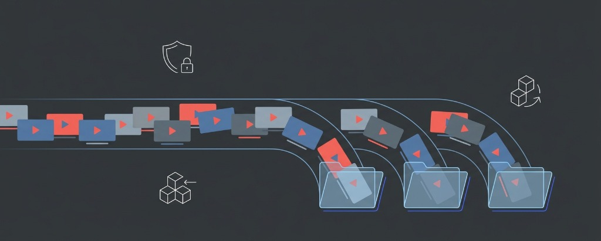

# YouTube 訂閱分組管理 (YouTube Subscription Folders)

<p align="center">
  
</p>

<p align="center">
  
</p>

<p align="center">
  <strong>一款輕量、高效、注重隱私的 YouTube 訂閱頻道分組與管理 Chrome 擴充套件（Manifest V3）。</strong><br />
  融合 <strong>QuickTube</strong> 的極簡側邊欄整合、<strong>FolderTube</strong> 的流暢現代體驗與 <strong>PocketTube</strong> 的強大動態牆過濾功能。
</p>

<p align="center">
  <a href="https://github.com/SunnyChan1010/youtube-subscription-folders/blob/main/LICENSE"></a>
  
  
  
</p>

---

## ✨ 核心功能特色

1. **YouTube 左側導覽列原生整合 (Sidebar Guide)**
   - 在 YouTube 左側邊欄自然嵌入「📁 分組訂閱」區塊。
   - 點擊展開/收合所屬頻道清單，點擊頻道直達頻道主頁；雙擊分組直接前往過濾動態牆。

2. **訂閱動態牆即時 Chip 標籤過濾 (/feed/subscriptions)**
   - 訂閱動態頂部提供滑動標籤列，一鍵即時切換主題影片。
   - 支援無限滾動（Infinite Scroll），向下加載影片自動持續過濾。
   - 自動屏蔽不相關的 Shorts 推薦橫列，享受純淨的主題動態牆。

3. **隱藏已觀看影片 (Hide Watched)**
   - 一鍵開啟「👁️ 隱藏已看」，自動過濾帶有進度條的已看影片，隨時掌握全新內容。

4. **隨處即時加入分組 (Quick Tagger)**
   - **頻道首頁**：在創作者頁面（/@handle）訂閱按鈕旁提供「📁 加入分組」按鈕。
   - **觀看影片時**：在任何影片播放頁（/watch?v=...）播放器下方亦可隨手打勾歸類，無須跳出當前影片！
   - 採用固定懸浮視窗定位，徹底杜絕被 YouTube 標頭外層裁切截斷的問題。

5. **後台管理與「未分類頻道」智慧專區**
   - 獨立管理頁面（Options）支援自訂分組圖示、名稱、描述與 **▲ / ▼ 排序**。
   - 提供「未分類頻道」專區，一眼查看尚未被歸類的訂閱，並提供下拉選單快速指派。
   - 完整支援 **JSON 備份匯出與匯入還原**。

6. **100% 本地存儲與極致隱私**
   - 所有分組與設定全數保存在瀏覽器本機（chrome.storage.local）。
   - 零外部伺服器連線、零廣告、零追蹤代碼。

---

## 🚀 安裝指南 (Installation)

1. **取得程式碼**：
   ```bash
   git clone https://github.com/SunnyChan1010/youtube-subscription-folders.git
   ```
   （或點擊 GitHub 右上方綠色 **Code** 按鈕下載 ZIP 並解壓縮）

2. **在 Chrome 瀏覽器載入**：
   - 開啟 Google Chrome 或 Microsoft Edge，在網址列輸入：
     ```text
     chrome://extensions/
     ```
   - 開啟右上角 **「開發人員模式 (Developer mode)」**。
   - 點擊左上角 **「載入未封裝項目 (Load unpacked)」**。
   - 選擇剛下載/克隆的 `youtube-subscription-folders` 資料夾。

3. **開始使用**：
   - 開啟 [YouTube](https://www.youtube.com/) 刷新頁面，即可開始建立自訂分組或於動態牆過濾影片！

---

## 📄 License
MIT License. Free for personal and non-commercial use.
